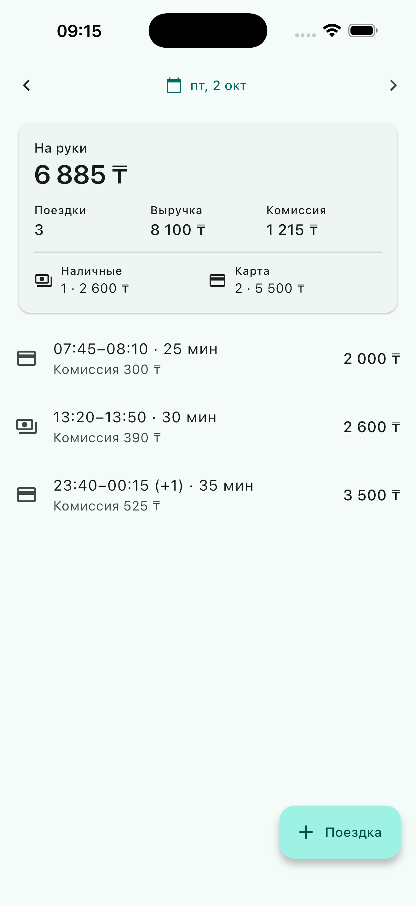
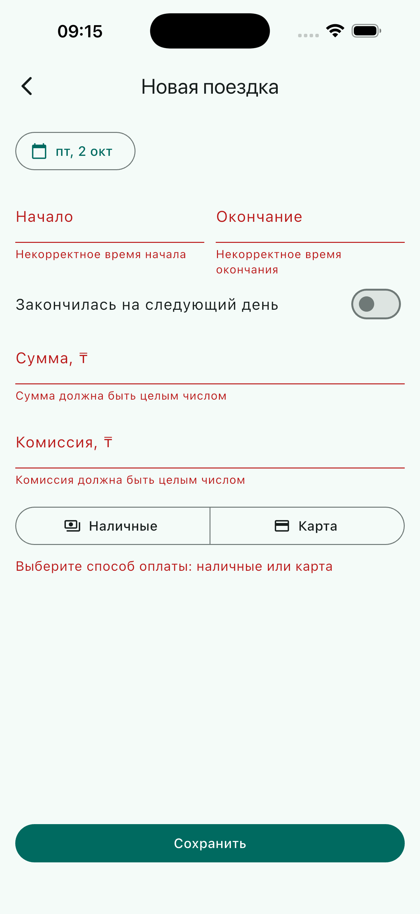

# Дневник смен водителя

Мобильное приложение (Flutter) + API (Dart): поездки за выбранный день, сводка за день, переключение дней, добавление поездки с проверкой данных и защитой от дублей.

| День | Новая поездка | Ошибки валидации |
|---|---|---|
|  |  |  |

## Как запустить

Нужно: Flutter 3.47+ (включает Dart 3.13), Xcode с iOS Simulator или Android Emulator. Проверено на iOS Simulator; Android Emulator поддерживается настройками (cleartext для debug), но на Android Emulator не запускался.

**Сервер** (порт 8080; при первом запуске база заполняется из `server/data/trips.json`):

```bash
cd server
dart pub get
dart run bin/server.dart
```

Переменные окружения: `PORT` (8080), `DRIVER_UTC_OFFSET` (`+05:00`), `DB_PATH` (`server/data/trips.db`), `SEED_PATH` (`server/data/trips.json`). Чтобы начать с чистыми данными — удалите `server/data/trips.db`.

**Приложение.** Во втором терминале, из корня репозитория:

```bash
cd app
flutter pub get
flutter run
```

iOS Simulator ходит на `http://localhost:8080`, Android Emulator — на `http://10.0.2.2:8080`. Для реального устройства: `flutter run --dart-define=API_URL=http://<IP компьютера>:8080`. Часовой пояс водителя в приложении задаётся `--dart-define=DRIVER_UTC_OFFSET=+05:00` (по умолчанию `+05:00`) и должен совпадать с `DRIVER_UTC_OFFSET` сервера.

**Тесты** (из корня репозитория):

```bash
(cd packages/trip_core && dart test)
(cd server && dart test)
(cd app && flutter test)
```

Сейчас: trip_core — 39, server — 24, app — 52 теста.

## Что сделано

- `GET /api/days/{YYYY-MM-DD}` — поездки за день и сводка: число поездок, выручка, комиссия, «на руки» (выручка − комиссия), разбивка наличные/карта.
- `GET /api/days` — дни, в которых есть поездки (приложение открывается на последнем).
- `POST /api/trips` — добавление с проверкой: сумма > 0, окончание позже начала, плюс комиссия от 0 до суммы, способ оплаты `cash`/`card`, время в ISO-8601 с часовым поясом.
- Приложение: сводка, список поездок, переключение дней стрелками и календарём, pull-to-refresh, форма добавления поездки.
- Тесты: расчёт сводки, валидация, группировка по дням, защита от дублей (в т.ч. 20 параллельных одинаковых запросов → одна запись), API, экраны приложения.
- Проверка в iOS Simulator (её выполнял ИИ-агент, управляя симулятором: нажатия, ввод, скриншоты): переключение дней, поездка через полночь, валидация формы, сохранение, повтор после обрыва связи — поездка сохраняется ровно один раз.

## API

| Запрос | Ответ |
|---|---|
| `GET /api/days` | `200 [{"date":"2026-10-01","tripCount":5}, …]` |
| `GET /api/days/2026-10-01` | `200 {"date", "summary": {"tripCount","revenue","commission","net","cash":{…},"card":{…}}, "trips": […]}` |
| `POST /api/trips` | `201` — создана · `200` — такая поездка уже есть (повтор) · `409` — тот же `id` с другими данными · `400 {"errors": {"поле": "сообщение"}}` |

## Решения

- **Защита от дублей.** Ключ идемпотентности — `id` поездки, его генерирует клиент (UUID при открытии формы). Повтор того же запроса → `200` и та же поездка, без новой записи; тот же `id` с другими данными → `409`. Атомарность даёт `PRIMARY KEY` в SQLite + `INSERT … ON CONFLICT DO NOTHING`, поэтому нет окна «проверили — вставили». Кнопка «Повторить» в форме отправляет поездку с тем же `id`, поэтому повтор после обрыва связи не создаёт дубль. Граница: если закрыть форму и ввести поездку заново, у неё будет новый `id` — такой дубль сервер не распознаёт (проверка пересечения поездок по времени — вне объёма задания).
- **Какой это день.** Поездка относится к дню своего начала по времени водителя (`DRIVER_UTC_OFFSET`, по умолчанию `+05:00`), а не по UTC: поездка в 00:30 по местному времени — это 19:30 UTC предыдущих суток. Поездка через полночь считается в день начала. При смене часового пояса водителя пришлось бы пересчитать дни в базе — для одного водителя это приемлемо.
- **Точность времени** — до секунды: дробная часть во входящем времени отбрасывается, поэтому повторная отправка ответа сервера — это повтор (`200`), а не конфликт.
- **Ввод времени** — только цифры, двоеточие подставляется само: `1023` → 10:23, `930` → 09:30, `20` → 20:00. Клавиатура цифровая; при выходе из поля время показывается полностью (`ЧЧ:ММ`).
- **Деньги** — целые тенге (`int`), без чисел с плавающей точкой; `2400.5` и `2400.0` отклоняются.
- **Время без часового пояса** (`2026-10-01T08:10:00`) отклоняется: непонятно, чьё это местное время, а `DateTime.parse` молча принял бы его за время сервера.
- **Одни правила для сервера и приложения.** Валидация и расчёт сводки — в общем пакете `packages/trip_core`; сервер их применяет, приложение использует ту же валидацию для мгновенных подсказок в форме.
- Если файл с начальными данными повреждён (не JSON или не массив), сервер пишет предупреждение в лог и всё равно запускается; некорректные отдельные записи пропускаются.
- Ошибка поля в форме исчезает, как только водитель исправляет это поле; проверка выполняется заново при сохранении.
- Про тест параллельных запросов: пакет `sqlite3` синхронный, сервер работает в одном isolate, так что тест в основном страхует от регрессий; гарантию даёт первичный ключ, и она сохранится, даже если код станет асинхронным.

## Структура

```
packages/trip_core/  модель, валидация, сводка (чистый Dart, общий для сервера и приложения)
server/              API: shelf + SQLite
app/                 Flutter-приложение
docs/                спецификация, план, заметки об ИИ, скриншоты
```

## Как я использовал ИИ

Инструмент — Claude Code. С его помощью: разбор задания, спецификация (`docs/superpowers/specs/`), пошаговый план (`docs/superpowers/plans/`), генерация кода и тестов по плану, ревью. Решения по архитектуре и семантике (идемпотентность, «какой это день», формат денег) принимались в диалоге и проверялись.

Мои решения по ходу работы: выбор стека (Flutter + Dart/shelf), объём (только форма добавления сверх минимума), утверждение спецификации и плана, решение, что сервер должен запускаться и при повреждённом файле начальных данных. Код, тесты, ревью и проверку в симуляторе выполняли ИИ-агенты; каждую задачу проверял отдельный агент-ревьюер.

Где ИИ ошибся и что исправлено:

1. **День недели.** При проектировании экрана ИИ подписал 2026-10-01 как среду («ср, 1 окт»). Проверка через `date` показала четверг — исправлены спецификация и ожидания в тестах.
2. **Структура монорепозитория.** ИИ сначала предложил Dart pub workspace для сервера, приложения и общего пакета. При разборе: workspace разрешает зависимости одним целым, и Flutter-приложение в нём привязало бы сборку сервера к Flutter SDK. Перешли на обычные `path:`-зависимости.
3. **API библиотеки «по памяти».** В `sqlite3` 3.x `dispose()` устарел в пользу `close()`, а сама SQLite подтягивается через build hooks. Реальный API проверен маленьким пробным скриптом до написания плана, а не взят из памяти о версии 2.x.
4. **Линты в форме добавления поездки.** Код формы из плана проходил тесты, но `flutter analyze` выдал два замечания `use_null_aware_elements` (`if (x != null) x!` в литералах коллекций). Поймано запуском `flutter analyze`; заменено на null-aware элемент `?x` (поведение то же).
5. **Устаревшие ошибки валидации.** Форма из плана держала ошибки полей до следующей отправки, поэтому исправленные значения всё ещё подсвечивались красным. Поймано ИИ-агентом при проверке в симуляторе: «10:00» и «1000» оставались помеченными как неверные. Теперь ошибки сбрасываются по полю при правке (`_clearErrors`; изменение начала также сбрасывает `end`, суммы — `commission`) без повторной валидации; добавлены два виджет-теста.
6. **Падение на файле начальных данных.** План в `server/bin/server.dart` позволял файлу начальных данных, который не JSON или не массив, бросить `FormatException` и остановить запуск, что противоречило спецификации («сервер всё равно запускается»). Поймано ИИ-ревьюером задачи; владелец выбрал «записать в лог и запуститься»; исправлено в da2b280.
7. **Дробные секунды ломали повтор.** `parseInstant` из плана принимал дробные секунды, сервер их сохранял, а в ответе время показывалось с точностью до секунды, поэтому повторная отправка ответа самого сервера давала `409` вместо повтора `200`. Поймано финальным ИИ-ревью (воспроизведено скриптом); время теперь отбрасывает дробную часть, добавлены тесты.
